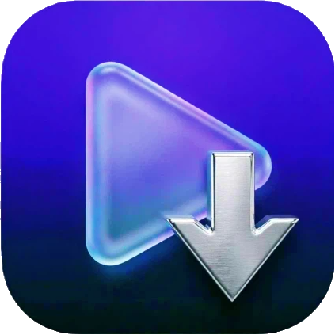
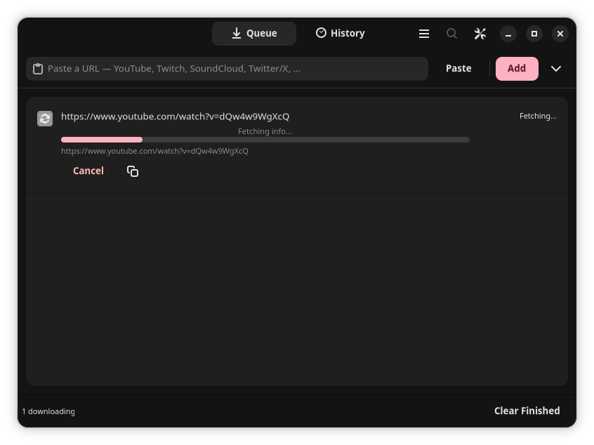
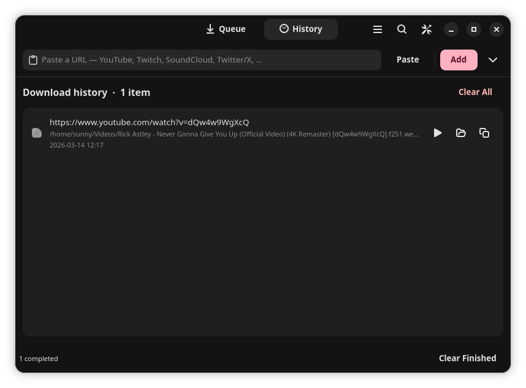

<h1 align="center">  <br><b>Aion-dl (Αἰών): A ytdlp GUI written in python </b></h1>

<div align='center'>
  
  
</div>

A polished GTK4 + Libadwaita GUI frontend for yt-dlp — fast, extensible, and user-friendly.

## 1. About
aion-dl exposes yt-dlp’s capabilities in a native GTK4/Libadwaita desktop app with per-job controls, concurrent downloads, advanced format/post-processing, subtitle & thumbnail management, SponsorBlock support, playlist handling, robust networking/auth, and a searchable history.

## 2. Features
- Video / audio-only / video-only downloads
- Quality presets: Best, 4K, 1080p, 720p, 480p, 360p, Worst
- Raw format string (-f) and format sort (-S)
- Configurable concurrent downloads and per-job progress (speed, ETA, cancel/retry)
- Batch import (one URL per line)
- Output containers: MP4, MKV, WebM, AVI, MOV
- Audio outputs: MP3, AAC, FLAC, Opus, Vorbis, WAV, M4A, ALAC
- Subtitles: SRT, ASS, VTT, LRC — download, embed, convert; regex language filter
- Thumbnails: write, embed as cover art, convert (JPG/PNG/WebP)
- Metadata: embed title/artist, chapters, write info.json/description/xattrs/.desktop
- SponsorBlock: mark chapters or remove segments; custom API URL
- Playlist controls: item spec, shuffle, lazy processing, max concurrency, concat policies
- Network: HTTP/SOCKS5 proxy, client impersonation, source binding, IPv4/IPv6 forcing
- Authentication: cookies (file or from browsers), username/netrc, client cert (PEM)
- Download robustness: concurrent fragments, retries, external downloaders (aria2c/axel/curl/ffmpeg/wget)
- Workarounds: skip cert validation, custom headers, JS runtime selection (deno/node/quickjs/bun)
- UI: Adwaita theming (System/Light/Dark), toast notifications, full history, keyboard shortcuts

## 3. Screenshots
Queue tab :


History tab :


(Place these images in the repository root or adjust paths if stored under /docs or /assets.)

## 4. Requirements
- Python >= 3.11 
- PyGObject >= 3.46 (python-gobject) 
- libadwaita >= 1.4 
- yt-dlp (pip install yt-dlp) 
- ffmpeg (for merging/post-processing)

## 5. Installation

Arch Linux
```bash
sudo pacman -S python-gobject libadwaita yt-dlp ffmpeg
```

Debian / Ubuntu
```bash
sudo apt install python3-gi python3-gi-cairo gir1.2-gtk-4.0 \
                 gir1.2-adw-1 yt-dlp ffmpeg
```

From source
```bash
git clone https://github.com/Piratheon/aion-dl.git
cd aion-dl
python3 -m venv .venv
source .venv/bin/activate
pip install -r requirements.txt   # if provided
python3 main.py
```

## 6. Usage
Run the app:
```bash
# From source (development)
export PYTHONPATH=$PYTHONPATH:$(pwd)/src
python3 -m aion_dl.main

# Or install it
pip install .
aion-dl
```
Pass a URL directly:
```bash
python3 -m aion_dl.main 'https://www.youtube.com/watch?v=dQw4w9WgXcQ'
```

## 7. Configuration
- Config: ~/.config/aion-dl/config.json 
- History: ~/.config/aion-dl/history.json

## 8. Project layout
Aion-dl/
├── pyproject.toml      — Build system configuration
├── requirements.txt    — Python dependencies
├── assets/             — Desktop entry, icon
│   ├── aion-dl.desktop
│   └── io.github.piratheon.aion-dl.png
├── src/
│   └── aion_dl/        — Main package
│       ├── __init__.py
│       ├── main.py        — GtkApplication entry point
│       ├── window.py      — MainWindow (Adw.ApplicationWindow)
│       ├── downloader.py  — yt-dlp subprocess engine
│       ├── models.py      — DownloadJob (GObject) + DownloadOptions
│       ├── config.py      — AppConfig dataclass + JSON persistence
│       ├── style.css      — Adwaita-compatible CSS tweaks
│       └── widgets/       — UI components
│           ├── __init__.py
│           ├── url_bar.py
│           ├── download_row.py
│           ├── format_panel.py
│           ├── settings_page.py
│           └── history_page.py
└── install.sh          — Dependency checker script

## 9. Contributing
- Fork the repo, create a feature branch, and open a pull request against main. 
- Follow PEP8 and GNOME/Adwaita UI conventions. 
- Include tests for non-trivial logic and update README/changelog for new features.

## 10. License
GPL — see [LICENSE](LICENSE) file.

## 11. Support
Report bugs or feature requests on the repository Issues page.

Maintainer: [Piratheon](https://github.com/Piratheon)
